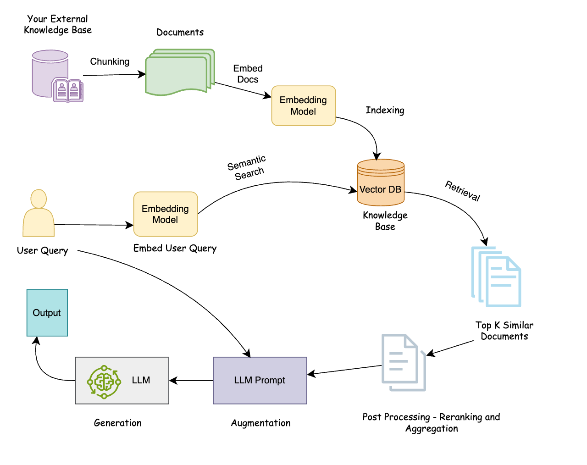

# RAG-Based AI Search System

A Retrieval-Augmented Generation search app over CS382/SEIR course lecture
material: ask a question in the Streamlit UI, and it retrieves the most
relevant chunks from the indexed PDFs/notes and answers *only* from them,
with citations and similarity scores. Off-topic questions get an explicit
"nothing relevant found" instead of a guessed answer — this is a document
search tool, not a general-purpose chatbot.

## Setup

```bash
pip install -r requirements.txt
streamlit run app.py
```

The first run downloads the `all-MiniLM-L6-v2` embedding model (~80MB) via
`sentence-transformers`, so it needs an internet connection once; after that
it's cached locally. Open the URL Streamlit prints (usually
`http://localhost:8501`).

To use "llm" answer mode (grounded answers from Gemini instead of raw
extracted passages), put a Google AI Studio key in `.env`:

```
GEMINI_API_KEY=your-key-here
```

Edit `.env` directly rather than pasting a real key into chat or a terminal
command — it's easy to accidentally leak a key into logs or shell history
that way. Without a key, "llm" mode falls back to "extractive" mode with an
explanatory message; "extractive" mode needs no key at all.

## Deployment (Dokploy)

The included `Dockerfile` builds a self-contained image (bakes in the
`all-MiniLM-L6-v2` embedding model at build time, so there's no first-request
delay or Hugging Face dependency at runtime) and runs Streamlit headless on
`$PORT` (defaults to `8501`).

To deploy on [Dokploy](https://dokploy.com):

1. Create an Application, point it at this repo, and set the build type to
   **Dockerfile**.
2. Set the container port to `8501` (or whatever `$PORT` you configure).
3. Add `GEMINI_API_KEY` as an environment variable in the Dokploy dashboard
   to enable "llm" mode — do **not** commit `.env` or bake the key into the
   image (it's git-ignored here for that reason).
4. Deploy. The `/_stcore/health` endpoint is used for the container
   healthcheck.

To build/run it locally first:

```bash
docker build -t rag-ai-search .
docker run -p 8501:8501 -e GEMINI_API_KEY=your-key-here rag-ai-search
```

## System architecture


*This diagram shows the LLM-generation path only. Extractive mode (this
app's default — no API key required) skips "Augmentation" and "LLM"
entirely: it goes straight from the retrieved/reranked chunks to a
highlighted-snippet answer. See step 6 below.*

1. **Ingest & chunk** (`rag/ingest.py`) — loads `.txt` and `.pdf` files
   (PDF text extraction via `pypdf`) and splits each document into
   overlapping, fixed-size word chunks (`chunk_text`).
2. **Embed** (`rag/embed_store.py`) — encodes each chunk into a 384-dim
   vector with `sentence-transformers`' `all-MiniLM-L6-v2`.
3. **Vector store** (`rag/embed_store.py`) — L2-normalized embeddings go
   into a local FAISS `IndexFlatIP` index; inner product over normalized
   vectors is equivalent to cosine similarity.
4. **Retrieve** (`rag/embed_store.py`) — the query is embedded the same
   way and `VectorStore.query()` returns the nearest chunks by cosine
   similarity. When reranking is on (see next step), a wider candidate
   pool (`max(top_k * 4, 15)`) is retrieved instead of just top-K, then
   narrowed back down after reranking.
5. **Rerank & aggregate** (`rag/rerank.py`, optional, on by default) —
   chunks that clear the relevance floor are re-scored with a
   cross-encoder (`cross-encoder/ms-marco-MiniLM-L-6-v2`), which judges
   query/chunk relevance jointly instead of comparing independent
   embeddings. The top-K survivors are kept in cross-encoder order (their
   original cosine score travels with them for the floor/display logic,
   unchanged); any chunks that are adjacent, same-document neighbors among
   those top-K are merged into a single contiguous passage. See
   `EVALUATION.md`'s "Reranking evaluation" section for a measured
   before/after comparison — including a documented case where reranking
   does *not* help.
6. **Generate** (`rag/generate.py`) — retrieved chunks below a minimum
   similarity score are dropped (`filter_relevant`); if none remain, the
   app returns a "nothing relevant found" message without calling an LLM.
   Otherwise, either `extractive_answer` (picks the most query-relevant
   sentence(s) out of each retrieved chunk and bolds the matched terms,
   no API key needed) or `llm_answer` (sends the chunks + query to Gemini
   and asks it to answer only from them, with citations) produces the
   final answer.
7. **Interface** (`app.py`) — Streamlit UI: query box, answer panel,
   an expandable/scored/term-highlighted sources panel, and a settings
   sidebar (top-K, a reranking on/off toggle, answer mode, Gemini model
   picker, chunk size/overlap, file upload for searching your own
   `.txt`/`.pdf` docs alongside the indexed corpus).

## Design decisions

- **Fixed-size word chunking with overlap**, not sentence- or
  section-aware chunking. Simple, dependency-free, and works uniformly
  across the noisy, inconsistently-formatted text that `pypdf` extracts
  from lecture slides (see Known limitations). Chunk size/overlap are
  adjustable from the sidebar; `overlap` is always clamped below
  `chunk_size` (see `rag/ingest.py`) since the naive stepping loop would
  never terminate otherwise.
- **`all-MiniLM-L6-v2` for embeddings** — small, fast, runs locally with no
  API key, and accurate enough for this corpus size (see `EVALUATION.md`:
  92% top-3 hit rate over 13 test queries).
- **FAISS `IndexFlatIP`** (exact brute-force search) rather than an
  approximate index — at ~170 chunks, exact search is effectively free, and
  an approximate index (`IndexIVFFlat`/`IndexHNSWFlat`) would only pay off
  at a much larger corpus scale.
- **Two answer modes.** `extractive` needs no API key and makes it possible
  to verify retrieval quality independent of generation quality — useful
  when debugging whether a bad answer is a retrieval problem or a
  generation problem. `llm` (Google AI Studio's Gemini) produces a written,
  cited answer grounded strictly in the retrieved chunks.
- **A minimum-similarity floor before generating** (`MIN_SIMILARITY = 0.25`
  in `rag/generate.py`). Retrieval always returns its top-K nearest chunks
  even for completely off-topic questions — cosine similarity has no
  built-in "nothing matched" signal — so without a floor, the system would
  synthesize an answer from irrelevant chunks instead of admitting it found
  nothing. The threshold was picked by inspecting the score distribution on
  this corpus: correct hits scored as low as 0.29, while clearly off-topic
  probe queries topped out around 0.14-0.19 (see `EVALUATION.md`).
- **Cross-encoder reranking operates on cosine score, not its own score.**
  `rag/rerank.py`'s cross-encoder decides ranking order and which chunks
  survive the narrowing to top-K, but the relevance floor and every
  downstream display value still use each chunk's original cosine score.
  This keeps the already-calibrated 0.25 floor valid without retuning, and
  keeps `rag/generate.py` completely unaware reranking exists — it still
  just receives a `List[Tuple[Chunk, float]]`. The cross-encoder score is
  surfaced separately, as a secondary badge, in the sources panel.

## Project structure

```
final_project_starter/
├── app.py                  # Streamlit interface
├── requirements.txt
├── EVALUATION.md            # retrieval + answer-quality eval results and write-up
├── data/sample_docs/        # CS382/SEIR lecture PDFs + a few placeholder .txt samples
├── rag/
│   ├── ingest.py            # load + chunk documents
│   ├── embed_store.py       # embed (sentence-transformers) + FAISS similarity search
│   ├── rerank.py            # cross-encoder reranking + adjacent-chunk aggregation
│   ├── generate.py          # relevance filtering + turn retrieved chunks into an answer
│   └── evaluate.py          # hit-rate / MRR evaluation harness (baseline vs. reranked)
└── tests/                   # unit tests (pytest) for ingest/generate/embed_store/rerank
```

## Evaluation

`rag/evaluate.py` runs 13 hand-written test queries against the full corpus
and reports hit rate / mean reciprocal rank for retrieval:

```bash
python -m rag.evaluate
```

`EVALUATION.md` has the full results table plus a written discussion of
retrieval quality, answer quality (including citation accuracy and the
graceful-failure behavior), successes, and limitations.

## Running the unit tests

```bash
python -m pytest tests/ -v
```

Unit tests for the chunking, relevance-filtering, and retrieval logic (fast,
no network calls beyond the one-time embedding model download) — distinct
from `rag/evaluate.py`, which measures end-to-end retrieval quality against
real queries.

## Known limitations

- **Generation quality is bottlenecked by retrieval.** If the right chunk
  isn't retrieved, the LLM correctly declines to answer from what it wasn't
  given rather than hallucinating — but the user still doesn't get a full
  answer. See the one retrieval miss discussed in `EVALUATION.md`.
- **The relevance floor is a coarse heuristic, not a learned classifier.**
  It's a single global cosine-similarity cutoff tuned by inspecting score
  distributions on this specific corpus, not something that adapts to query
  type. A borderline off-topic query that happens to share vocabulary with
  the corpus could still slip past it.
- **PDF slide text extraction is noisy** — `pypdf` sometimes runs titles and
  words together (e.g. `"THE MAGICBEHIND THESEARCH BOX"`). Embeddings are
  fairly robust to this, but it occasionally shows up verbatim in extractive
  answers or quoted fragments.
- **No multi-hop reasoning.** Each answer comes from a single retrieval
  pass; a question that requires combining facts from two corpus sections
  that don't share vocabulary (so both wouldn't be retrieved together)
  won't be answered completely.
- **Small, static corpus.** 16 documents / ~167 chunks, indexed with an
  exact-search FAISS index. Uploading extra files at query time works but
  triggers a full rebuild of the in-memory index (no incremental indexing).
- **Reranking is not guaranteed to help, and can amplify an existing bias.**
  On this corpus it left hit-rate/MRR unchanged (92%, 0.92 both ways) and
  did *not* fix the one documented retrieval miss — the cross-encoder is
  more sensitive to fluent, well-formed phrasing than cosine similarity is,
  which made it favor a generic placeholder chunk even more strongly over
  noisier-but-correct real lecture content. See `EVALUATION.md`'s
  "Reranking evaluation" section.
